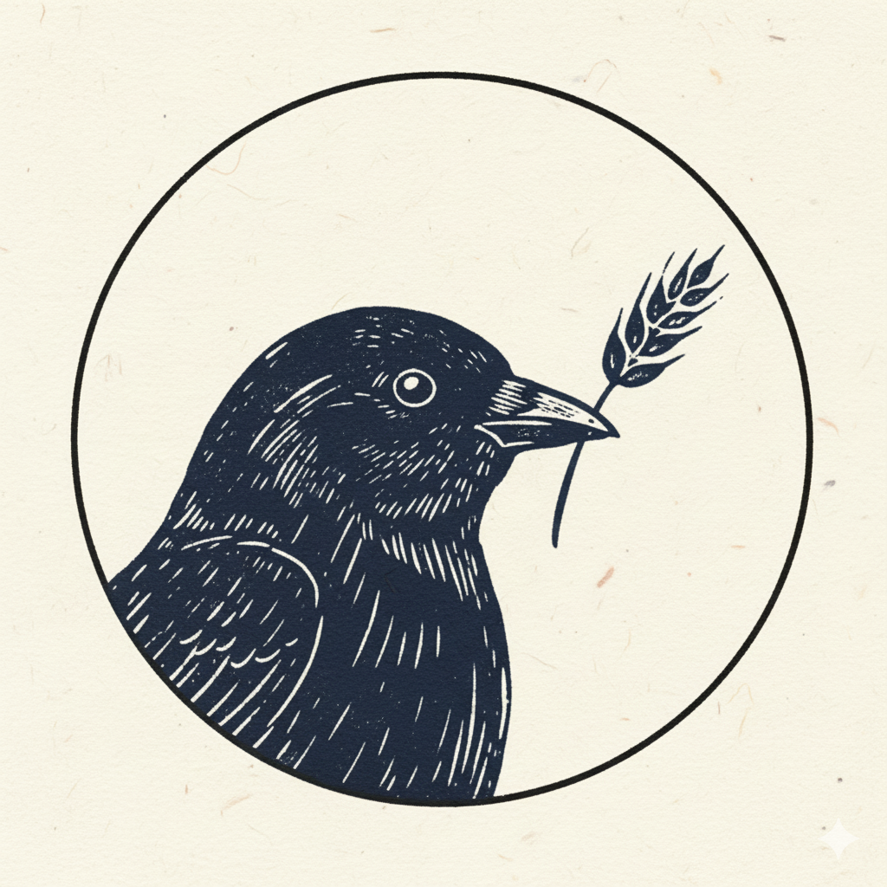
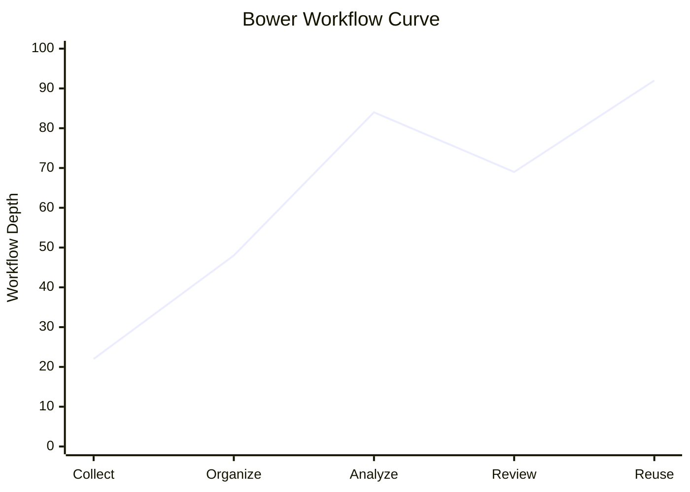

# Bower

<p align="center">
  
</p>

<p align="center">
  A local-first design archive for collecting inspiration, organizing boards, and extracting visual cues with AI.
</p>

<p align="center">
  <a href="#tech-stack">
    
  </a>
  <a href="#browser-extension">
    
  </a>
  <a href="#data--privacy">
    
  </a>
  <a href="#license">
    
  </a>
</p>

<p align="center">
  <a href="#overview">Overview</a> ·
  <a href="#feature-surfaces">Feature Surfaces</a> ·
  <a href="#tech-stack">Tech Stack</a> ·
  <a href="#quick-start">Quick Start</a> ·
  <a href="#browser-extension">Browser Extension</a> ·
  <a href="#data--privacy">Data & Privacy</a> ·
  <a href="#development">Development</a> ·
  <a href="#license">License</a>
</p>

## Overview

Bower is a local-first reference management system for visual research and design curation. It is built for workflows where collecting, structuring, and reusing inspiration matters as much as storing it.

The repository currently ships with:

- A Next.js web application for archive browsing, collections, timeline review, upload, login, and settings
- A FastAPI backend for metadata, boards, AI analysis, user preferences, and local account APIs
- A bundled browser extension for sending web images into the Bower workflow
- SQLite-backed local storage plus filesystem-based asset storage

## Feature Surfaces

### Web App

- `Archive`: browse collected references, filter by board, inspect details, and archive items
- `Collections`: manage boards and create new board categories
- `Timeline`: review materials in chronological order
- `Upload`: add new references from local files
- `Login`: local account entry for the current app setup
- `Settings`: interface preferences and account controls
- `AI Settings`: provider and model configuration

### Browser Extension

- Trigger image analysis or clipping from the browser
- Use the same Bower branding and popup settings surface
- Works as a companion entry point to the local app

## Core Capabilities

- Upload inspiration images in `PNG`, `JPEG`, and `WEBP`
- Store files locally with content-addressable paths
- Save metadata such as title, source URL, notes, and board assignment
- Generate AI summaries and tags with multiple provider options
- Switch between archive, collections, and timeline review modes
- Create and manage boards for clearer curation
- Keep user preference and account data inside the local app environment

## Tech Stack

| Layer | Implementation |
| --- | --- |
| Frontend | Next.js 15, React 19, TypeScript |
| Styling | App-level CSS and custom UI components |
| Backend | FastAPI, Uvicorn |
| Database | SQLite |
| File Storage | Local filesystem, content-addressable storage |
| AI Providers | OpenAI, Anthropic, Google AI Studio, ByteDance Volcano / Ark |
| Browser Extension | Manifest V3 |
| Workspace Tooling | pnpm workspaces, Turbo, uv |

## Repository Layout

```text
apps/
  server/              FastAPI backend
  web/                 Next.js frontend
browser-extension/     Manifest V3 extension
docs/
  Architecture.md      Architecture rationale
  DesignSystem.md      UI direction and tokens
  QA/                  Smoke checklists
scripts/
  dev.mjs              Root development launcher
```

## Quick Start

### Prerequisites

- Node.js `18+`
- `pnpm`
- [`uv`](https://docs.astral.sh/uv/)
- An AI provider key if you want to run image analysis

### Install

```bash
npm run install:web
npm run sync:server
```

### Configure

Frontend:

```bash
# apps/web/.env.local
NEXT_PUBLIC_API_BASE_URL=http://127.0.0.1:8000/api/v1
```

AI settings are primarily configured inside the app at `/settings/ai`.

Legacy environment variable fallback still exists for local automation and CI:

```bash
BOWER_AI_PROVIDER=openai

# OpenAI
BOWER_OPENAI_API_KEY=your-key
BOWER_OPENAI_MODEL=gpt-4.1-mini
BOWER_OPENAI_BASE_URL=https://api.openai.com

# Anthropic
BOWER_ANTHROPIC_API_KEY=your-key
BOWER_ANTHROPIC_MODEL=claude-3-5-haiku-latest

# Google AI Studio
BOWER_GOOGLE_API_KEY=your-key
BOWER_GOOGLE_MODEL=gemini-2.5-flash

# ByteDance Volcano / Ark
BOWER_ARK_API_KEY=your-key
BOWER_ARK_MODEL=your-endpoint-id
```

### Run

Unified local startup:

```bash
npm run dev
```

Or run services separately:

```bash
# Terminal 1
npm run dev:server

# Terminal 2
npm run dev:web
```

Available local surfaces:

- Web app: `http://localhost:3000`
- API docs: `http://localhost:8000/docs`

## Browser Extension

The project includes a bundled browser extension in [`browser-extension/`](./browser-extension).

### Included Files

- [`browser-extension/manifest.json`](./browser-extension/manifest.json)
- [`browser-extension/background.js`](./browser-extension/background.js)
- [`browser-extension/content.js`](./browser-extension/content.js)
- [`browser-extension/popup.html`](./browser-extension/popup.html)
- [`browser-extension/popup.js`](./browser-extension/popup.js)

### Load As Unpacked Extension

1. Open your Chromium-based browser extensions page
2. Enable developer mode
3. Choose `Load unpacked`
4. Select the `browser-extension/` directory

The extension now uses the same Bower logo as the web app and repository branding.

## API Surface

The FastAPI backend currently exposes routes for:

- `inspirations`
- `image analysis`
- `boards`
- `account`
- `AI settings`
- `preference settings`

All API responses follow an envelope pattern:

```json
{
  "data": {}
}
```

or

```json
{
  "error": {
    "code": "ERROR_CODE",
    "message": "Human readable message"
  }
}
```

## Data & Privacy

Bower is designed around a local-first model:

- Images are stored on the local filesystem
- Metadata is stored in local SQLite
- AI provider settings can be configured from the app instead of hardcoding secrets in the repo
- The repository only tracks `.env.example`, not real `.env` files

### Repository Privacy Review

A quick repository scan found:

- No obvious committed API keys, private keys, or personal email addresses
- No tracked `.env` files containing live credentials
- Test-only placeholders such as `Bearer test-key`, which are expected and non-sensitive

## Development

### Root Commands

```bash
npm run dev
npm run dev:server
npm run dev:web
npm run install:web
npm run sync:server
npm run test:server
npm run build:web
```

### Frontend

```bash
cd apps/web
npm run build
npm run lint
```

### Backend

```bash
uv run --directory apps/server pytest
```

Single-file example:

```bash
uv run --directory apps/server pytest tests/test_inspirations_api.py
```

## Project Status

This repository is in active product iteration. The current codebase already covers the main archive workflow and browser extension integration, but it is still evolving in areas such as packaging, documentation depth, and release formalization.

## License

There is currently no `LICENSE` file committed in the repository, so the open-source license should be treated as pending until one is added.

## Conceptual Workflow Curve

The chart below is an illustrative workflow curve for how Bower is meant to be used. It is not product telemetry.


